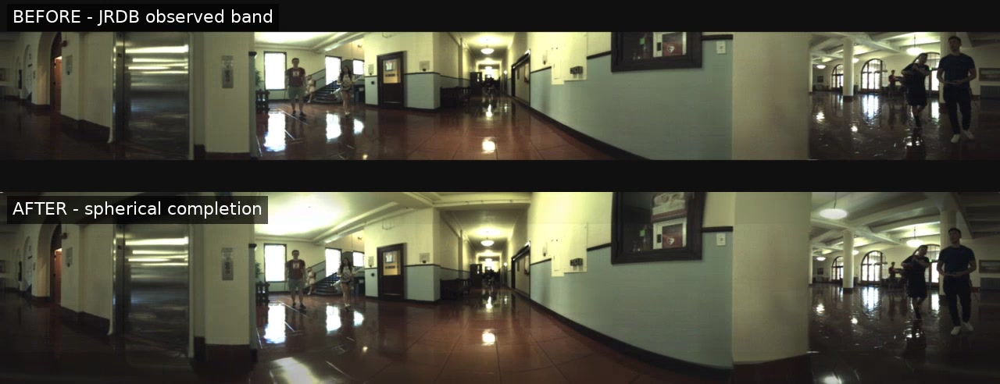

# JRDB Spherical Completion

本项目按冻结方案将 JRDB stitched `3760×480` 观测带补全为 `3760×720`，正式主线为：

```text
JRDB 3760×480
  → 球面坐标重采样到标准 2:1 ERP 1440×720
  → Wan2.1 VACE-14B，81 帧 masked video-to-video
  → 17 帧窗口重叠、条件锁定与 latent-noise 复用
  → W/2 经度滚动第二遍生成并只在合成区修复接缝
  → 球面逆映射到 3760×720
  → 中央 y=[120,600) 直接覆盖原始像素
```

冻结技术方案见 [`docs/JRDB_MOT_SPHERICAL_COMPLETION_PLAN_2026-08.md`](docs/JRDB_MOT_SPHERICAL_COMPLETION_PLAN_2026-08.md)。旧 SDXL/单帧 API 配置只保留作历史对照，不再是生产入口。

## 81 帧前后对比

[](assets/jrdb_81_frame_before_after.mp4)

[▶ 播放或下载 MP4 视频](assets/jrdb_81_frame_before_after.mp4)

- 序列：`cubberly-auditorium-2019-04-22_1`
- 帧数与帧率：81 帧，15 FPS（5.4 秒）
- 上半部分：原始 `3760×480` JRDB 观测带，居中放入同尺度画布
- 下半部分：补全后的 `3760×720` 球面结果
- 中央观测区直接保留 JPEG 解码后的原始像素；新增内容只位于顶部和底部合成区

## 已实现约束

- 中央观测区最终从 JPEG 解码后的输入直接复制，PNG 回读校验 `max_abs_error=0`。
- 代理画布按像素中心经纬度映射；`2048×1024` 等高分辨率代理不会误用固定 120 行。
- 横向采样周期取模；VACE 采用原经度与滚动 `W/2` 两遍，只融合顶部/底部合成区。
- 每个序列生成确定性的 81/17 窗口清单、配置指纹、逐窗口状态和逐帧完成哈希。
- 相邻窗口复用前一窗口尾部的 5 个 VAE latent-noise 帧，并把 17 个重叠 RGB 帧作为不可编辑 VACE 条件；不做逐帧 RGB 淡入淡出。
- 每帧写出 synthetic mask；合成区不复制为 GT，只能作为 ignore region。
- 输出结构为 `images/image_stitched`、`mot/<seq>/img1`、`synthetic_masks`、`metadata`、`quality` 和根 `manifest.json`。
- 未显式选择序列且未限制帧数的全量运行会先检查至少 150 GiB 可用空间。

## 数据与默认配置

- 输入：`/root/autodl-tmp/JRDB2019-MOT/images/image_stitched`
- 数据：27 个序列，27,661 帧
- 主配置：`configs/jrdb_vace14b_pro6000.json`
- 资源缓存：`/root/autodl-tmp/model_cache_v2`
- 输出：`/root/autodl-tmp/datasets/JRDB-Spherical-VFOV180-VACE`
- VACE 环境：`.venv-vace`（Python 3.10、PyTorch CUDA 12.8）；84 GB 单卡默认使用同精度 CPU offload，避免 T5/DiT/VAE 峰值显存重叠。
- CPU/下载工具环境：`.venv`
- 完整解析后的环境快照：`requirements/vace-resolved-cu128.lock.txt`

## 无 GPU 准备

完整准备命令：

```bash
cd /root/autodl-tmp/jrdb_spherical_completion
bash scripts/prepare_all.sh
```

该命令会：

1. 按固定 commit 拉取 VACE、Wan2.1、Seen-to-Scene、RAFT、TrackEval 和 deep-person-reid；ProPainter 直接使用固定 release 的 flow-completion 权重，避免下载无关演示资产。
2. 对固定 VACE/Wan commit 应用 `1440×720` 精确尺寸、跨窗口 noise 复用和 84 GB 同精度显存补丁。
3. 构建独立 `.venv-vace` 和 CPU 工具环境；固定 CUDA 12.8 PyTorch 与 FlashAttention wheel，FlashAttention 不可用时保留 PyTorch SDPA 回退。
4. 下载固定 revision 的 `Wan-AI/Wan2.1-VACE-14B`、RAFT、ProPainter flow completion、Faster R-CNN 与 OSNet 权重。
5. 对每个文件计算 SHA-256，只有文件完整且无 `.incomplete` 时才写入 `resources_manifest_v2.json` 的 `ready=true`。

下载器不会初始化 CUDA，支持重复执行与断点续传：

```bash
.venv/bin/python scripts/download_resources.py \
  --config configs/jrdb_vace14b_pro6000.json \
  --hf-endpoint https://hf-mirror.com
```

只生成窗口清单、不编码视频：

```bash
.venv/bin/jrdb-sphere --config configs/jrdb_vace14b_pro6000.json stage \
  --sequences cubberly-auditorium-2019-04-22_1 \
  --limit-frames 81 --manifest-only
```

同时编码 VACE 的 source/mask 与 W/2 rolled source/mask：去掉 `--manifest-only`。

## CPU 验证

```bash
.venv/bin/pytest -q
.venv/bin/jrdb-sphere --config configs/jrdb_vace14b_pro6000.json inspect
```

不加载生成模型的三帧几何诊断：

```bash
.venv/bin/jrdb-sphere --config configs/jrdb_vace14b_pro6000.json run \
  --backend edge --sequences cubberly-auditorium-2019-04-22_1 --limit-frames 3
.venv/bin/jrdb-sphere --config configs/jrdb_vace14b_pro6000.json verify \
  --sequences cubberly-auditorium-2019-04-22_1 --limit-frames 3
```

## 开启 GPU 后

不要直接跑全量。先运行三类连续 81 帧：

```bash
cd /root/autodl-tmp/jrdb_spherical_completion
bash scripts/run_gpu_smoke.sh
```

该脚本依次运行：

- `cubberly-auditorium-2019-04-22_1`
- `discovery-walk-2019-02-28_0`
- `indoor-coupa-cafe-2019-02-06_0`

每个序列都执行 VACE、几何验证和 detector/ReID 质量检查。全部通过并完成人工抽检后，才可扩展到每类 243 帧，再评估完整短序列。

单独运行一个 81 帧窗口：

```bash
bash scripts/run_offline_vace.sh --config configs/jrdb_vace14b_pro6000.json run \
  --backend vace14b \
  --sequences cubberly-auditorium-2019-04-22_1 \
  --limit-frames 81
```

84 GB 单卡必须保留配置中的 `offload_model=true`。运行时会在阶段边界卸载 T5、VAE、输入条件和已生成的 VACE hints，并对 RoPE 的 FP64 临时张量分块；权重、分辨率、81 帧、50 steps、guidance 和 BF16 autocast 均不改变，也不使用量化。`PYTORCH_CUDA_ALLOC_CONF=expandable_segments:True` 等运行环境已由 `run_offline_vace.sh` 设置。

RTX 6000D 实测同一窗口连续完成 3 个采样 step，采样期 `nvidia-smi` 占用约 83,230 MiB、剩余约 1,804 MiB，每步约 157 秒。primary 和 rolled 各 50 steps，单窗口总时间预计约 4.4 小时。中断的窗口保持 `running` 状态，重复执行上面的命令会用相同 seed 和 noise 重新生成，不会把半成品登记为完成。

## 质量门禁

结构门禁：

```bash
.venv/bin/jrdb-sphere --config configs/jrdb_vace14b_pro6000.json verify \
  --sequences cubberly-auditorium-2019-04-22_1 --limit-frames 81
```

检测/ReID 门禁：

```bash
bash scripts/run_offline_vace.sh --config configs/jrdb_vace14b_pro6000.json quality \
  --sequences cubberly-auditorium-2019-04-22_1 --limit-frames 81
```

当前工作区是 JRDB test 图像，没有 MOT ground truth，因此可完成中央像素、接缝、mask、生成区 person 检测和成对 ReID 门禁，但 HOTA/IDF1/MOTA 必须在提供对应 GT 后交给固定 commit 的 TrackEval 执行。任何顶部/底部内容均不得声明为真实 GT。

## 已知上游限制

固定的 Seen-to-Scene 仓库描述了 RAFT、ProPainter flow completion 与自训练 UNet/latent refinement，但没有发布其 `checkpoint-100000`。本项目因此准备其公开 RAFT/flow-completion 组件，并把参考条件、重叠锁定和 latent-noise 传播移植到 VACE wrapper；资源清单会明确记录这一点，不伪造缺失的官方 checkpoint。

当前磁盘容量不足以满足全量生产前的 150 GiB 空闲要求。即使权重与环境准备完成，全量 27,661 帧仍必须先扩容。
